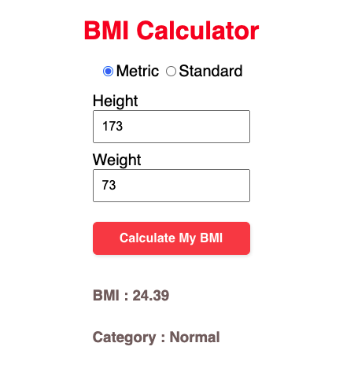

# My Awesome Project
For our First Worknight Group Project, we decided to make a simple BMI Calculator. 

 

## How It's Made:

**Tech used:** HTML, CSS, JavaScript, Framework of choice

This project was made using Vanilla Javascript and is built upon the simple NoeJS backend created for Class 37 of 100 Devs.

## Lessons Learned:

Very obvious why Express is NEEDED! 

